# Lab Center – Hands-On Lab 
## Session 6117<br/>Hands-on Speech to Text Customization and Speech Grammar


**Abhishek Shrivastava**<br/>
Digital Technical Engagement - Data Science and AI<br/>
abhia@ibm.com

**Bijo Thomas**<br/>
Digital Technical Engagement - Data Science and AI<br/>
bijo.thomas1@ibm.com

**Jason Brown**<br/>
Digital Technical Engagement - Data Science and AI<br/>
jasonbro@us.ibm.com

# 1 Introduction

Watson Speech to Text service is part of AI services available in IBM Cloud.

The service provides speech transcription capabilities for your applications. The service leverages machine learning to combine knowledge of grammar, language structure, and the composition of audio and voice signals to accurately transcribe the human voice. It continuously updates and refines its transcription as it receives more speech.

The service provides various interfaces that make it suitable for any application where speech is the input and a textual transcript is the output. Example applications include

* Voice control of applications, embedded devices, and vehicle accessories
* Transcribing meetings and conference calls
* Dictating email messages and notes

The service is ideal for clients who need to extract high-quality speech transcripts from call center audio. Clients in industries such as financial services, healthcare, insurance, and telecommunication can develop cloud-native applications for customer care, customer voice, agent assistance, and other solutions.

## 1.1 Key Capabilities

Watson Speech to Text provides out of the box speech to text capability in several languages such as English, Spanish, German, Chinese, Japanese, Korean etc. using audio in most common audio formats. Audio files are broadly classified as Broadband and Narrowband. Audio that are sampled at 16 kHz or higher are supported using Broadband models and audio that are sampled at 8 kHz are supported using Narrowband models.

The service provides significant additional data about the transcription and provides powerful customization capabilities that could be leveraged for domain specific audio.

* **Language Model Customization**<br/>
Customize the machine learning models to speak the terminology of your business.
* **Acoustic Model Customization**<br/>
Use domain specific audio to customize the acoustic models
* **Speech Grammar**<br/>
Greatly increase the accuracy of speech in situations where speech follows specific pattern or narrow selection of words.
* **Speaker Diarization**<br/>
Service can segment and tag transcriptions based on speakers identified in the audio.
* **Word Alternatives, Confidence and Timestamp**<br/>
Response includes alternate words that are acoustically similar to the primary word detected, confidence level of each word detected and the timestamps in the audio input at which the words were detected.

This lab explores the customization capabilities and grammar support in Watson Speech to Text service.

## 1.2 High Level Runtime Architecture

Speech to Text deployments can have varied architecture. The following diagram illustrates an example in which audio input from user is transcribed using Speech to Text service. The audio can be from various channels such as mobile devices, internet browser, live microphone, stored audio files etc. The application logic layer can be used invoke the speech to text service and process the transcription response.

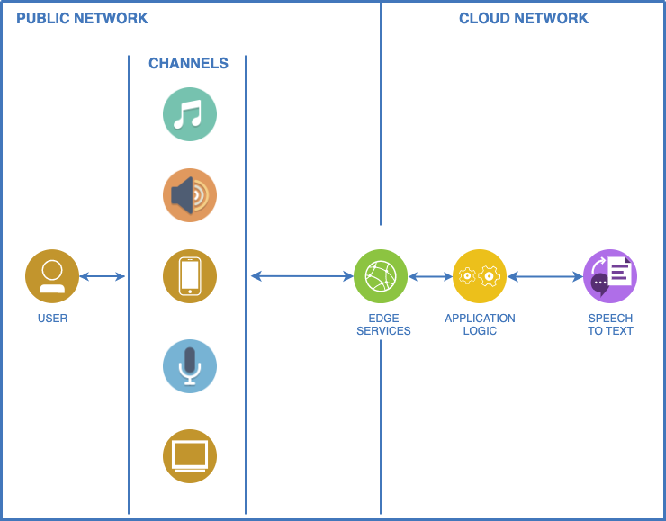

This lab uses a much simplified architecture, which can be outlined as the following diagram.

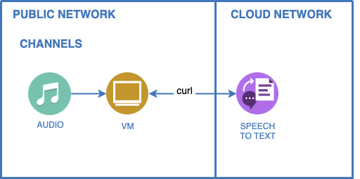

Speech to Text is powered by several machine learning models that are provided out of the box and are customizable. The models are provided for several natural languages.

## 1.3 Customization

The IBM Speech to Text service offers a customization interface that you can use to augment its speech recognition capabilities. You can use customization to improve the accuracy of speech recognition requests by customizing a base model for your domain and audio. Customization is available for only some languages and at different levels of support for different languages.

The customization interface supports both custom language models and custom acoustic models. The interfaces for both types of custom model are similar and straightforward to use. Using either type of custom model with a recognition request is also straightforward: You specify the customization ID of the model with the request.

Speech recognition works the same with or without a custom model. When you use a custom model for speech recognition, you can use all of the input and output parameters that are normally available with a recognition request.

### 1.3.1 Language Customization

The service was developed with a broad, general audience in mind. The service's base vocabulary contains many words that are used in everyday conversation. Its models provide sufficiently accurate recognition for many applications. But they can lack knowledge of specific terms that are associated with particular domains.

The language model customization interface can improve the accuracy of speech recognition for domains such as medicine, law, information technology, and others. By using language model customization, you can expand and tailor the vocabulary of a base model to include domain-specific terminology.

You can create a custom language model and add corpora and words specific to your domain. Once you train the custom language model on your enhanced vocabulary, you can use it for customized speech recognition. The service can typically train any custom model in a matter of minutes. The level of effort that it takes to create a model depends on the data that you have available for the model.

### 1.3.2 Acoustic Customization

Similarly, the service was developed with base acoustic models that work well for various audio characteristics. But in cases like the following, adapting a base model to suit your audio can improve speech recognition:

* Your acoustic channel environment is unique. For example, the environment is noisy, microphone quality or positioning are suboptimal, or the audio suffers from far-field effects.
* Your speakers' speech patterns are atypical. For example, a speaker talks abnormally fast or the audio includes casual conversations.
* Your speakers' accents are pronounced. For example, the audio includes speakers who are talking in a non-native or second language.

The acoustic model customization interface can adapt a base model to your environment and speakers. You create a custom acoustic model and add audio data (audio resources) that closely match the acoustic signature of the audio that you want to transcribe. Once you train the custom acoustic model with your audio resources, you can use it for customized speech recognition.

The length of time that it takes the service to train the custom model depends on how much audio data the model contains. In general, training takes twice the length of the cumulative audio. The level of effort that it takes to create a model depends on the audio data that you have available for the model. It also depends on whether you use transcriptions of the audio.

### 1.3.3 Grammars

Custom language models allow you to expand the service's base vocabulary. Grammars enable you to restrict the words that the service can recognize from that vocabulary. When you use a grammar with a custom language model for speech recognition, the service can recognize only words, phrases, and strings that are recognized by the grammar. Because the grammar defines a limited search space for valid matches, the service can deliver results faster and more accurately.

You add a grammar to a custom language model and train the model just as you do for a corpus. Unlike a corpus, however, you must explicitly specify that a grammar is to be used with a custom model during speech recognition.

# 2 Getting Started

This lab is based on Watson Speech to Text service available in IBM public cloud. You need a Standard plan instance of Speech to Text to perform customizations. For the purpose of this lab, each of you will get following from the instructor, which will allow you access to a pre-provisioned Standard plan instance of the service in IBM Cloud.

1. API Key – Access key to use the API
2. URL – Service location

> For you to work on Speech to Text customization after this lab on your own, you will need to create your Standard plan Speech to Text instance in IBM Cloud. You will need an IBM Cloud account to create a service instance. Creating account and service instance is not within the scope of this lab, but you can refer to Appendix I of this lab guide for some quick guide on doing it.

This lab guide refers to the directory **C:\Lab** as your **work directory**. If you don't have that directory in your VM, please create it.

All terminal commands listed in this lab are defined to be executed using the **cmd** terminal available in the Windows 10 VM that you have access to as part of this lab. Also, they are defined to be executed from the work directory. If you execute from a different directory, you will need to make necessary changes to the commands.

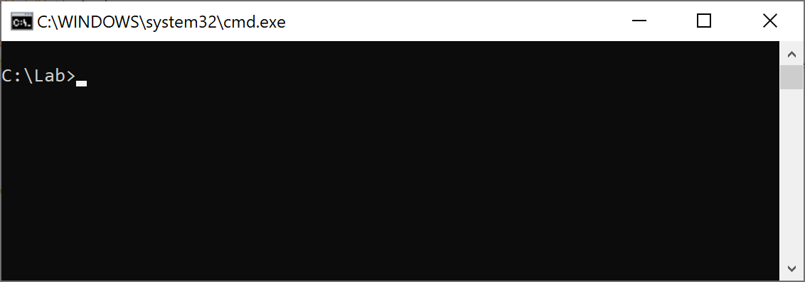

Since API Key and URL are part of almost all commands you use this lab, for convenience, we store them as environment variables and the commands refer to them as variables. If you open a new terminal window, you will need to set them again in the new window.

```batch
C:\Lab> set APIKEY=[Your API Key with Double Quotes]
C:\Lab> set URL=[Your Service URL without Double Quotes]
```

For example, if your API Key is `b1DzrXLeZWnuRdylhacJTA4e-_Y4Vk_2bZoO5TEDErt1` and URL is `https://api.us-south.speech-to-text.watson.cloud.ibm.com/instances/cb07aa2a-e12e-4ae3-a8e1-6c2b31ef385e`, the commands will be

```batch
C:\Lab> set APIKEY="b1DzrXLeZWnuRdylhacJTA4e-_Y4Vk_2bZoO5TEDErt1"
C:\Lab> set URL=https://api.us-south.speech-to-text.watson.cloud.ibm.com/instances/cb07aa2a-e12e-4ae3-a8e1-6c2b31ef385e
```

Most commands use **curl** to execute. So, let's make sure you have curl in your Window 10 VM. Run following command in your terminal

```batch
C:\Lab> curl
```

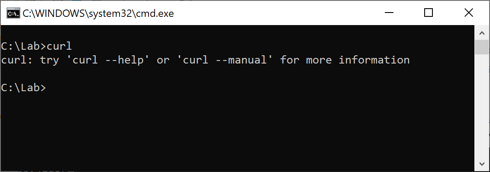

If you see the same response as in the above screenshot, you have curl installed and proceed.

> In case if you don't have curl in your VM, download curl binary from following URL
>
> https://curl.haxx.se/windows/dl-7.70.0/curl-7.70.0-win64-mingw.zip
>
> Extract the zip file to your work directory and rename the folder curl-7.70.0-win64-mingw to curl, so that you have curl.exe at the path C:\Lab\curl\bin\curl.exe
>
> Add curl.exe to system path in your terminal
> ```batch
> C:\> set PATH=C:\Lab\curl\bin\;%PATH%
> ```
>
> You will need to set this path in every new terminal window you open.
>
> Once the path is set, try `curl` command in terminal again to verify you get a response similar to what you see in above screenshot.

## 2.1 Warming Up

To request speech recognition with the IBM Speech to Text service, you need to provide only the audio that is to be transcribed. The service offers the same basic transcription capabilities with each of its interfaces: the WebSocket interface, the synchronous HTTP interface, and the asynchronous HTTP interface.

In this lab, we use synchronous HTTP interface using curl.

The following sections show basic transcription requests, with no optional input or output parameters.

Download the audio file and store it in your work directory<br/>
<https://atbijo.github.io/audio-file.flac/>

> The VMs cannot play the audio files. To listen to them, you can download the file to your local machine from the same GitHub link above.

Issue the following command to call the service's `/v1/recognize` method for basic transcription with no parameters. The example uses the `Content-Type` header to indicate the type of the audio, `audio/flac`. The example uses the default language model, `en-US_BroadbandModel`, for transcription

```batch
C:\Lab> curl -X POST -u apikey:%APIKEY% --header "Content-Type: audio/flac" --data-binary @audio-file.flac "%URL%/v1/recognize" > warmup.json
```

Note: Remember, we have API Key and URL from instructor which we have set as environment variables APIKEY and URL.

Open the output file warmup.json in Notepad. The transcription result look like the following

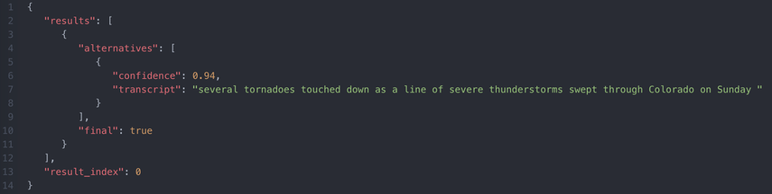

Transcript text can be seen against the name "transcript". You can also see "confidence" value of this transcription.

For a full list of parameters and additional details you can get with the transcription, such as speaker labels, word alternatives etc., see the API specification at

<https://cloud.ibm.com/apidocs/speech-to-text#recognize-audio/>

# 3 Exercise A: Language Model Customization

This exercise will show you how audio files containing domain terminology can be transcribed with higher accuracy with use of language model customization.

To better appreciate this section of the lab, you may want to play the audio files in respective sections and listen to it.

> The VMs cannot play the audio files. To listen to them, you can download the file to your local machine from the GitHub links provided in respective sections.

## 3.1 Getting the Files

Download the following audio files and store it in your work directory

<https://atbijo.github.io/automotive.flac/><br/>
<https://atbijo.github.io/automotive.wav/>

Download the language model customization file and store it in your work directory

<https://atbijo.github.io/automotive-lm.txt/>

## 3.2 Transcribe without Language Model Customization

Issue the following command to call the service's `/v1/recognize` method for basic transcription with no parameters. The example uses the `Content-Type` header to indicate the type of the audio, `audio/flac`. The example uses the default language model, `en-US_BroadbandModel`, for transcription

```batch
C:\Lab> curl -X POST -u apikey:%APIKEY% --header "Content-Type: audio/flac" --data-binary @automotive.flac "%URL%/v1/recognize" > automotive-flac.json
```

Open the output file automotive-flac.json in Notepad. The transcription result look like the following

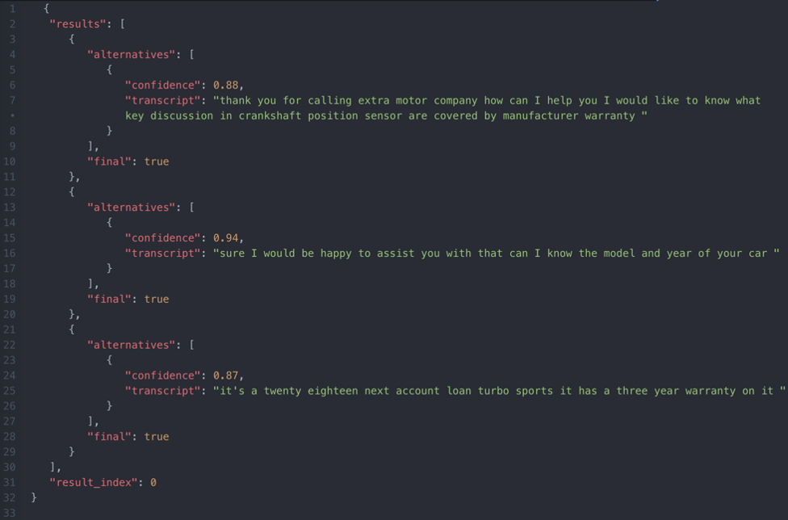

If you had listened to the audio, you would have noticed the speakers mentioning certain domain terms such as **Nzeckster**, **key escutcheon**, **Nzeckster Countlone** etc. As you can see in the transcript, some of these domain terms did not get transcribed correctly.

Now, let's try the same audio in a different audio format. You have the file automotive.wav in your work directory, which is the same conversation in a different audio format.

You can issue the following command to call the same API method with the audio file automotive.wav. The `Content-Type` header now indicates the type of the audio as `audio/wav`.

```batch
C:\Lab> curl -X POST -u apikey:%APIKEY% --header "Content-Type: audio/wav" --data-binary @automotive.wav "%URL%/v1/recognize" > automotive-wav.json
```

Output in automotive-wav.json will be similar to the previous output seen in automotive-flac.json.

## 3.3 Create Language Model Corpus

Language model corpus is a text file containing common utterances in your domain that you expect your users would say, the audio for which is intended to be transcribed with your Speech to Text instance. You can extrapolate the utterances with common variations. You can also repeat the utterances to improve the accuracy.

An example language model will look like this.

```
calling Nzeckster Motor Company
calling Nzeckster Motor Company
is key escutcheon covered by warranty
do you cover key escutcheon in manufacturer warranty
is crankshaft position sensor covered in warranty
does my warranty cover crankshaft position sensor
I use a Nzeckster Countlone turbo sports model
mine is a Nzeckster Countlone
it's a Nzeckster Countlone
```

For this lab, the corpus is provided to you in the automotive-lm.txt file that you have already downloaded and is available in your work directory.

Follow below steps to create and train a language model.

Issue the following command to call the service's /v1/customizations method to create a new language model in your Speech to Text instance. You need to provide a name for your new model and also need to provide the name of the base language model your custom model is based on. You can also provide an optional description.

For a full list of supported language models, visit<br/>
<https://cloud.ibm.com/docs/services/speech-to-text?topic=speech-to-text-models#modelsList/>

In this lab, we are creating a custom model against US English Broadband base model.

```batch
C:\Lab> curl -X POST -u apikey:%APIKEY% --header "Content-Type: application/json" --data "{\"name\": \"autolm\", \"base_model_name\": \"en-US_BroadbandModel\", \"description\": \"Automotive Model\"}" "%URL%/v1/customizations" > automotive-customization-id.json
```

The service creates a new language customization id and it would be stored in the file automotive-customization-id.json in your work directory.

View the content of automotive-customization-id.json by opening it in Notepad, which looks similar to below

```
{"customization_id": "00f1b7134-23d1-4ad2-8b0d-a1218ad69abe"}
```

You will use the value against name `customization_id` in following commands. So please note that down. For convenience, you can set that an environment variable as below. Following sections in this lab uses this environment variable in commands. If you open a new terminal window, you will need to set them again in the new window.

```batch
C:\Lab> set AUTO_LM=[Your Customization Id without Double Quotes]
```

Now you can add corpus to your custom language model you just created

Issue the following command to call the service's `/v1/customizations/{customization_id}/corpora/{corpus_name}` method to add the corpus to the new custom language model.

```batch
C:\Lab> curl -X POST -u apikey:%APIKEY% --data-binary "@automotive-lm.txt" "%URL%/v1/customizations/%AUTO_LM%/corpora/autocorpus"
```

Once added, you can check the status of the corpus by issuing following command

```batch
C:\Lab> curl -X GET -u apikey:%APIKEY% "%URL%/v1/customizations/%AUTO_LM%/corpora/autocorpus"
```

Response will look like this

```javascript
{
   "out_of_vocabulary_words": 2,
   "total_words": 53,
   "name": "autocorpus,
   "status": "being_processed"
}
```

Initial status will be `being_processed`. Wait until the status changes to `analyzed`. Reissue the command to see updated status.

Now you are ready to train your custom language model.

Issue the following command to call the service's `/v1/customizations/{customization_id}/train` method to initiate training of the new custom language model.

```batch
C:\Lab> curl -X POST -u apikey:%APIKEY% --data "{}" "%URL%/v1/customizations/%AUTO_LM%/train"
```

Once the training is initiated, you can check the status of the custom model by issuing following command.

```batch
C:\Lab> curl -X GET -u apikey:%APIKEY% "%URL%/v1/customizations/%AUTO_LM%"
```

The response will look like this

```javascript
{
   "owner": "1a864ef2-711d-4a0a-19e2-31bf4b9bdef0",
   "base_model_name": "en-US_BroadbandModel",
   "customization_id": "00f1b7134-23d1-4ad2-8b0d-a1218ad69abe",
   "dialect": "en-US",
   "versions": ["en-US_BroadbandModel.v2020-01-16"],
   "created": "2020-05-04T02:26:29.495Z",
   "name": "autolm",
   "description": "Automotive Model",
   "progress": 0,
   "language": "en-US",
   "updated": "2020-05-05T17:01:20.214Z",
   "status": "training"
}
```

Initial status will be `training`. Wait until the status changes to `available`. Reissue the command to see updated status.

Now you are ready to use your custom language model.

## 3.4 Transcribe with Language Model Customization

Issue the following command to call the service's `/v1/recognize`. Notice the customization id being passed with parameter `language_customization_id`. The example uses the `Content-Type` header to indicate the type of the audio, `audio/flac`. The example uses the default language model, `en-US_BroadbandModel`, for transcription

```batch
C:\Lab> curl -X POST -u apikey:%APIKEY% --header "Content-Type: audio/flac" --data-binary @automotive.flac "%URL%/v1/recognize?language_customization_id=%AUTO_LM%" > automotive-flac-customized.json
```

Open the output file automotive-flac-customized.json in Notepad. The transcription result look like the following

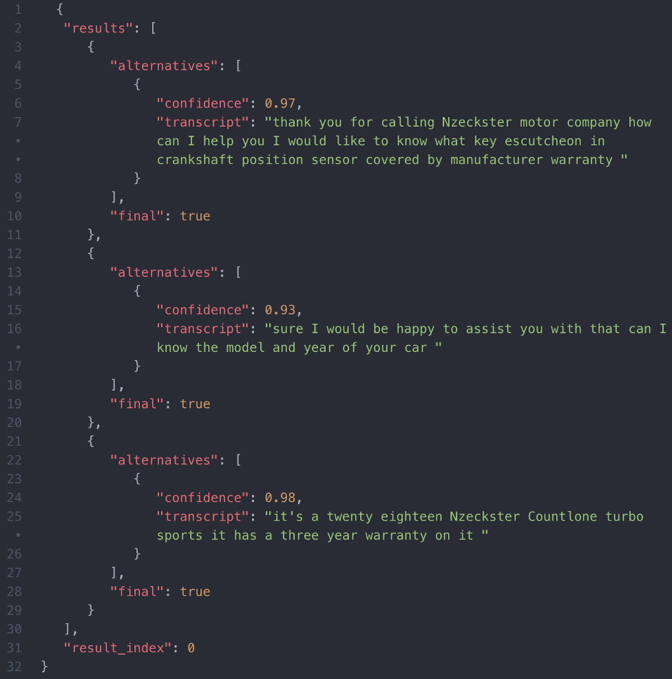

As you can see, the domain terms such as Nzeckster, key escutcheon or Nzeckster Countlone are now transcribed with improved accuracy.

You can see an interactive demo of Speech to Text customization, with side by side comparison of base model transcription and custom model transcription at below link

<https://www.ibm.com/demos/live/speech-to-text/self-service/>

This concludes the language model customization exercise.

# 4 Exercise B: Grammars

This exercise will show you how audio files containing specific formatted data can be transcribed with higher accuracy with use of grammar definition.

For example, when you need to recognize specific words or phrases, such as yes or no, individual letters or numbers, or a list of names, using grammars can be more effective than examining alternative words and transcripts. Moreover, by limiting the search space for valid strings, the service can deliver results faster and more accurately.

Grammar support is provided in Speech to Text service based on Speech Recognition Grammar Specification: <https://www.w3.org/TR/speech-grammar//>

The service currently does not support all features of the specification. To know more about what's not supported, see below page

<https://cloud.ibm.com/docs/services/speech-to-text?topic=speech-to-text-grammars#grammarSpecification/>

Grammar is supported in both Augmented Backus-Naur Form (ABNF) and XML Form.

For example, a yes or no grammar will look like below in ABNF

```
# ABNF 1.0 ISO-8859-1;
language en-US;
mode voice;
root $yesno;

$yesno = yes | no ;
```

In XML Form, it will look like below

```xml
<grammar version="1.0" xml:lang="en-US" root="yesno"
	xmlns="http://www.w3.org/2001/06/grammar">
	<rule id="yesno">
		<one-of>
			<item>yes</item>
			<item>no</item>
		</one-of>
	</rule>
</grammar>
```

In this lab, we use XML Form.

## 4.1 Defining Grammar

Let's imagine a situation when user tells a claim number over voice. The claim number contains letters and numbers. Many of the letters or numbers can sound like common words, some listed below

T - tea
B - bee, be
C - see, sea
2 - to, too
K - okay
S - yes

Many of these are challenging voices to transcribe correctly if left to open language speech models.

However, it can be simpler if we use grammar to limit the search space. If the search is limited to just letters and numbers instead of all the dictionary words, many of these confusion matrixes can be eliminated narrowing to very few possible results from the voice, hence improving transcription accuracy.

Claim number could in fact be following a stricter pattern, which can further narrow the search space.

In this lab, let's imagine a claim number which follow below pattern

Two letters followed by six numbers. First letter should be either K, Q or T 

An XML grammar definition of this pattern can be found at below URL. Download and store it in your work directory.
<https://atbijo.github.io/claim-number-grammar.xml/>

This looks similar to following. Note that the section below has trimmed the list of letters and numbers for display purposes. To see the full definition, see the claim-number-grammar.xml which you just downloaded to your work directory.

```xml
<grammar version="1.0" xml:lang="en-US" root="patterns"
	xmlns="http://www.w3.org/2001/06/grammar">
	<rule id="patterns">
		<one-of>
			<!-- pattern: 8 positions [KQT][A-Z][0-9]{6} -->
			<item>
				<ruleref uri="#firstletters" />
				<ruleref uri="#letters" />
				<ruleref uri="#numbers" />
				<ruleref uri="#numbers" />
				<ruleref uri="#numbers" />
				<ruleref uri="#numbers" />
				<ruleref uri="#numbers" />
				<ruleref uri="#numbers" />
			</item>
		</one-of>
	</rule>
	<rule id="firstletters">
		<one-of>
			<item>K.</item>
			<item>Q.</item>
			<item>T.</item>
		</one-of>
	</rule>
	<rule id="letters">
		<one-of>
			<item>A.</item>
			<item>B.</item>
			...
			...
			<item>Y.</item>
			<item>Z.</item>
		</one-of>
	</rule>
	<rule id="numbers">
		<one-of>
			<item>zero</item>
			<item>one</item>
			...
			...
			<item>eight</item>
			<item>nine</item>
		</one-of>
	</rule>
</grammar>
```

## 4.2 Adding Grammar to Custom Language Model

Let's add this grammar definition to the automotive language model we created in Exercise A.

Issue the following command to call the service's `/v1/customizations/{customization_id}/grammars/{grammar_name}` method to add the grammar file to custom model.

```batch
C:\Lab> curl -X POST -u apikey:%APIKEY% --header "Content-Type: application/srgs+xml" --data-binary @claim-number-grammar.xml "%URL%/v1/customizations/%AUTO_LM%/grammars/claimnumber"
```

Once added, you can check the status of the grammar by issuing following command

```batch
C:\Lab> curl -X GET -u apikey:%APIKEY% "%URL%/v1/customizations/%AUTO_LM%/grammars/claimnumber"
```

Response will look like this

```javascript
{
   "out_of_vocabulary_words": 0,
   "name": "claimnumber,
   "status": "being_processed"
}
```

Initial status will be `being_processed`. Wait until the status changes to `analyzed`. Reissue the command to see updated status.

Now you are ready to train your custom language model.

Issue the following command to call the service's `/v1/customizations/{customization_id}/train` method to initiate training of the new custom language model.

```batch
C:\Lab> curl -X POST -u apikey:%APIKEY% --data "{}" "%URL%/v1/customizations/%AUTO_LM%/train"
```

Once the training is initiated, you can check the status of the custom model by issuing following command.

```batch
C:\Lab> curl -X GET -u apikey:%APIKEY% "%URL%/v1/customizations/%AUTO_LM%"
```

Response will look like this

```javascript
{
   "owner": "1a864ef2-711d-4a0a-19e2-31bf4b9bdef0",
   "base_model_name": "en-US_BroadbandModel",
   "customization_id": "00f1b7134-23d1-4ad2-8b0d-a1218ad69abe",
   "dialect": "en-US",
   "versions": ["en-US_BroadbandModel.v2020-01-16"],
   "created": "2020-05-04T02:26:29.495Z",
   "name": "autolm",
   "description": "Automotive Model",
   "progress": 0,
   "language": "en-US",
   "updated": "2020-05-05T17:01:20.214Z",
   "status": "training"
}
```

Initial status will be `training`. Wait until the status changes to `available`. Reissue the command to see updated status.

Now you are ready to use new grammar.

## 4.3 Transcribe without Grammar

Download the audio file from below location and store it in your work directory.
<https://atbijo.github.io/claim-number.flac/>

To better appreciate this section of the lab, you may want to play the audio file claim-number.flac and listen to it.

> The VMs cannot play the audio files. To listen to them, you can download the file to your local machine from the same GitHub link provided above.

Issue the following command to call the service's `/v1/recognize` without any parameters. The example uses the `Content-Type` header to indicate the type of the audio, `audio/flac`. The example uses the default language model, `en-US_BroadbandModel`, for transcription.

```batch
C:\Lab> curl -X POST -u apikey:%APIKEY% --header "Content-Type: audio/flac" --data-binary @claim-number.flac "%URL%/v1/recognize" > claim-number.json
```

Service response in claim-number.json looks like below


If you had listened to the audio, you would have noticed that the first letter spoken, actually `T`, sounds very similar to `D` and gets transcribed incorrectly as `D`.

Now let's see if grammar makes a difference.

## 4.4 Transcribe with Grammar

We will use the same audio file claim-number.flac, which is already in your work directory.

Issue the following command to call the service's `/v1/recognize`. Notice the customization id being passed with parameter `language_customization_id` and grammar name passed with parameter `grammar_name`.  The example uses the `Content-Type` header to indicate the type of the audio, `audio/flac`. The example uses the default language model, `en-US_BroadbandModel`, for transcription.

```batch
C:\Lab> curl -X POST -u apikey:%APIKEY% --header "Content-Type: audio/flac" --data-binary @claim-number.flac "%URL%/v1/recognize?language_customization_id=%AUTO_LM%&grammar_name=claimnumber" > claim-number-grammar.json
```

Service response in claim-number-grammar.json looks like below

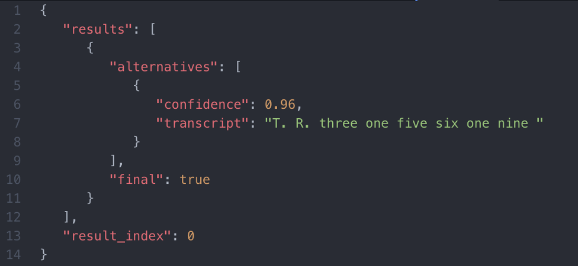

You can see the first letter `T` in the audio is now correctly transcribed.

This concludes the Speech Grammar exercise.

# 5 Appendix I - IBM Cloud Account and Speech to Text Instance

If you already don’t have an IBM Cloud account, which you can use to create Standard plan instance of Speech to Text service, follow below steps

## 5.1 Set up your IBM Cloud account

Go to and click **Create an Account**

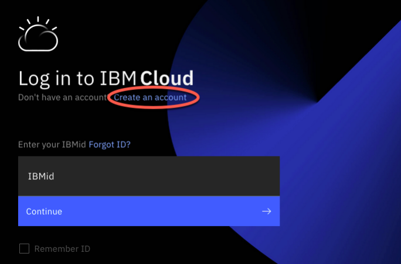

Enter your email address, verify it, and provide your information.

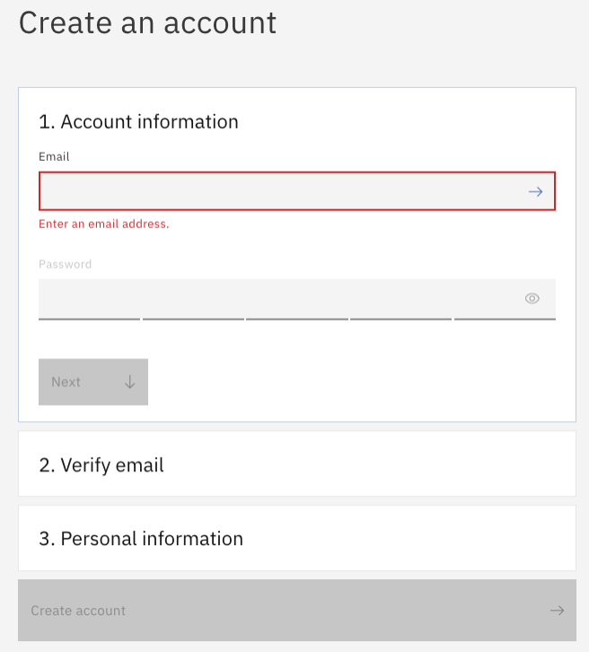

Once you have verified your email address and filled in the required fields, the **Create account** button will become active and you can click it. Within few minutes, you will receive an email that your account has been created.

Open the **Welcome to IBM Cloud** email and click **Log in**

When you login to IBM Cloud for the first time, you will be prompted to review IBM’s privacy policy. Proceed if you agree.

## 5.2 Provision Speech to Text instance

Once logged in, your landing page should look like below

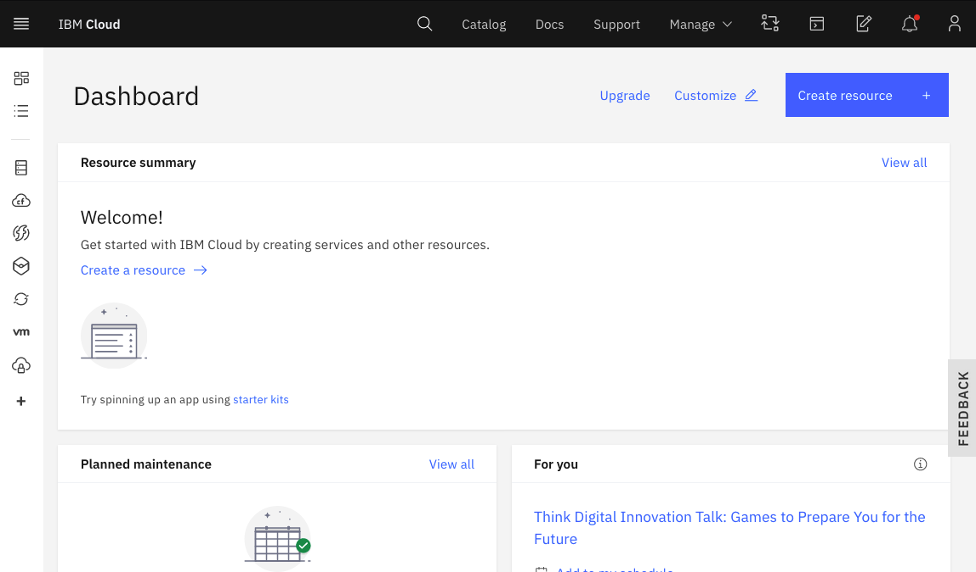

If you don’t already have a Standard plan Speech to Text instance, search for **speech to text** in the top search bar and click **Speech to Text** from the Catalog Results.

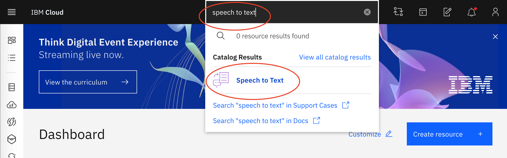

Speech to Text can be created with **Lite**, **Standard** and **Premium** plans. Features addressed in this lab are only available in **Standard** or higher plan. Choose a region closer to you, review the costs associated with the plan you select and click **Create**.

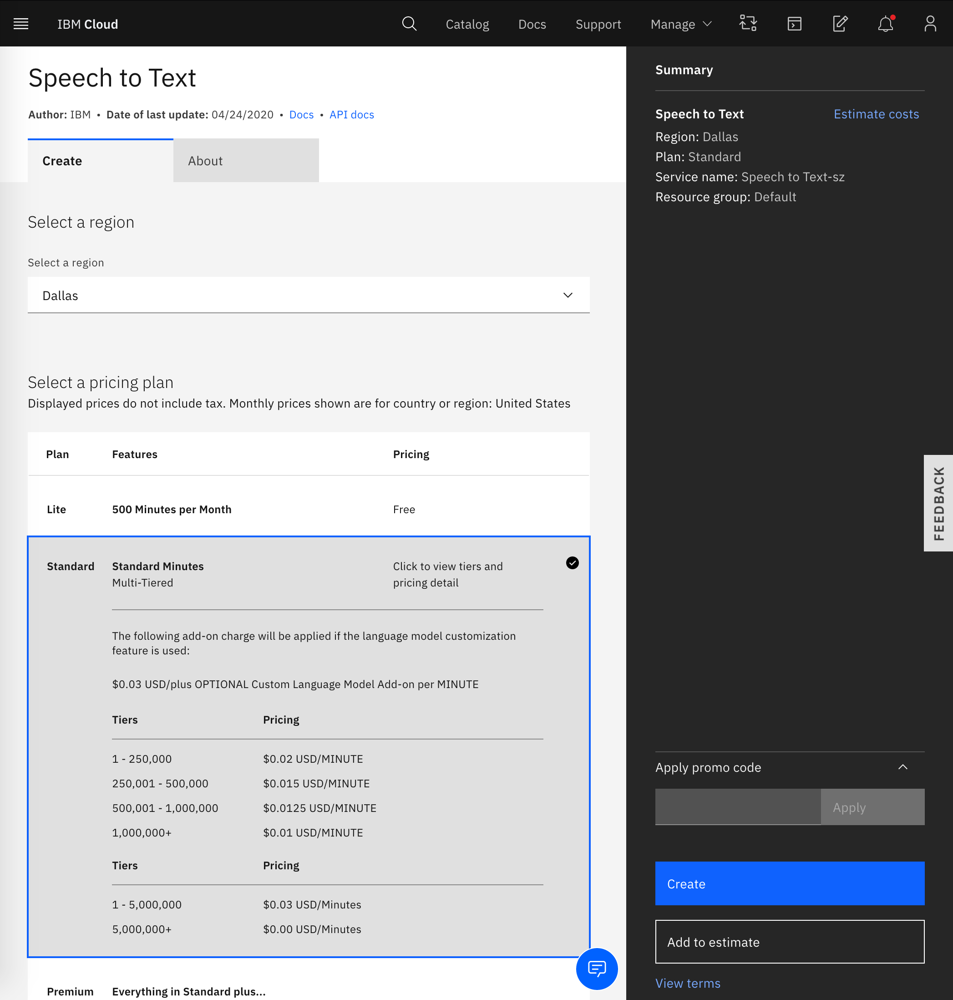

Note the API key and URL from the following start page of the service instance

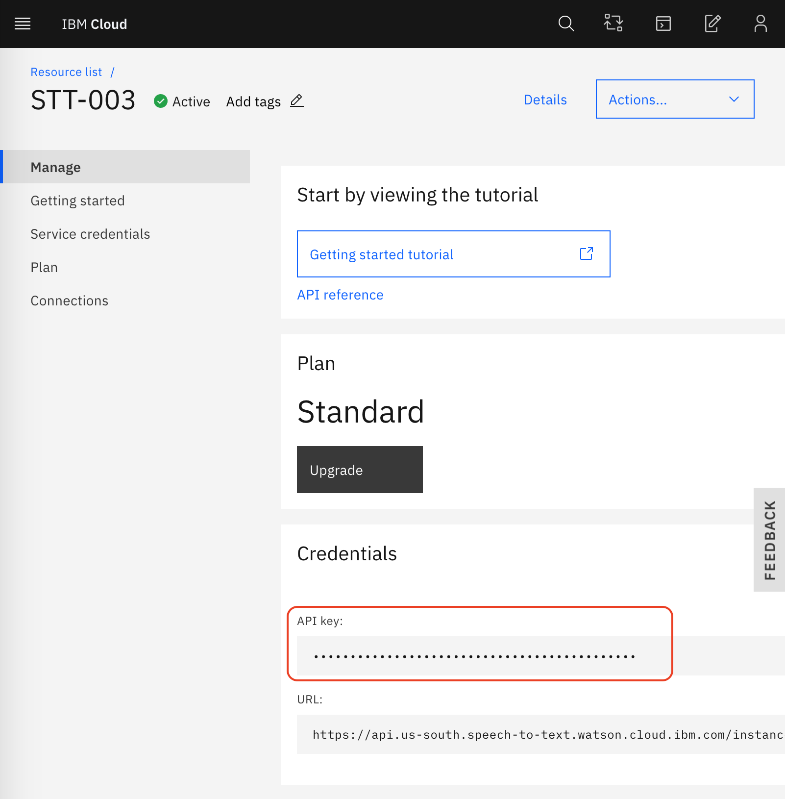

This API key and URL can be used with the curl commands to do your own customization.

# 6 Appendix II - Evaluating Accuracy

When you train custom models, Word Error Rate (WER) is a common measure of accuracy to determine if your custom model has improved. It’s calculated using below formula.


where

**S** is the number of substitutions,<br/>
**D** is the number of deletions,<br/>
**I** is the number of insertions,<br/>
**C** is the number of correct words,<br/>
**N** is the number of words in the reference (N=S+D+C)

However, relying solely on WER could be counterproductive at times. For example, if you are trying to identify ID numbers, incorrect detection of a single character would make the whole ID incorrect, or if you are using the transcription with downstream services such as Watson Assistant, error in one word may not make any difference.

You can read more about it here

[Why The Overall Voicebot Solution And User Experience Are More Important Than Speech Accuracy](https://medium.com/ibm-watson/why-the-overall-voicebot-solution-and-user-experience-are-more-important-than-speech-accuracy-d229bf54aede)
